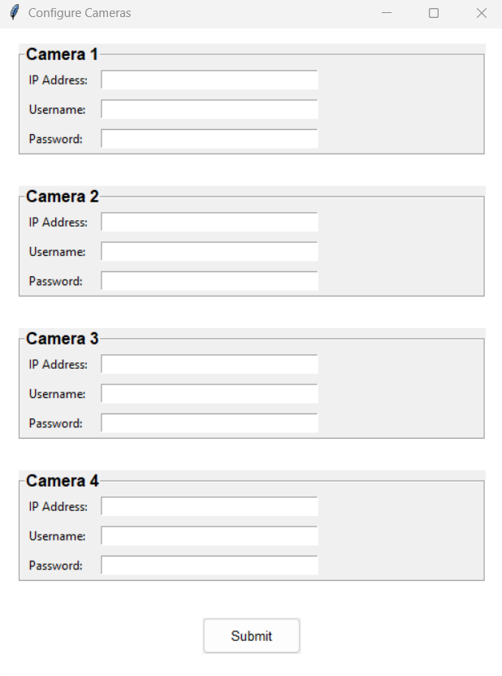
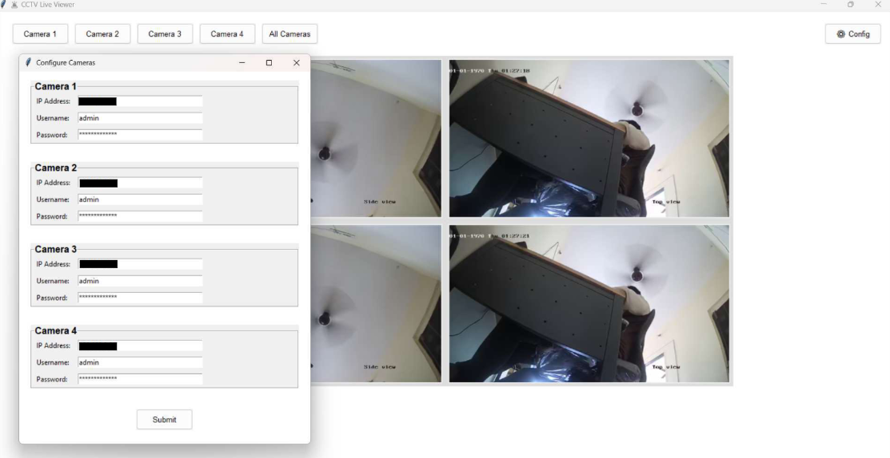
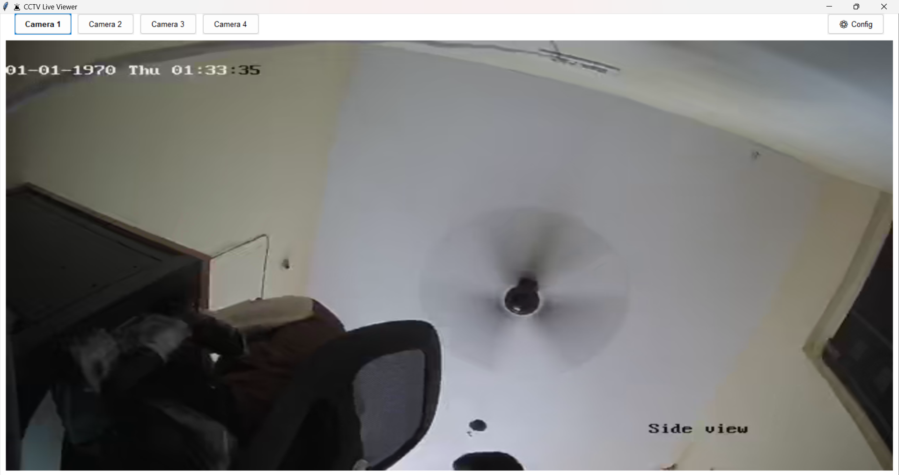

# 📹 CCTV Live Viewer

**CCTV Live Viewer** is a desktop application built with Python and Tkinter that allows users to **view live RTSP streams** from up to four IP cameras. It provides a user-friendly interface, configuration window and support for both single and multi-camera viewing.

---

## 🧰 Features

- ✅ Live streaming from up to 4 RTSP-compatible cameras  
- ✅ View individual or multiple camera feeds simultaneously  
- ✅ Secure configuration panel for entering camera credentials  
- ✅ Password masking and safe config file storage  
- ✅ Auto-shutdown after 5 minutes of inactivity  
- ✅ Prevents multiple instances from launching simultaneously  
- ✅ Custom UI styling with dynamic button highlighting  

---

## 🖼️ Screenshots

<table>
  <thead>
    <tr>
      <th style="width: 30%;">Description</th>
      <th style="width: 70%;">Preview</th>
    </tr>
  </thead>
  <tbody>
    <tr>
      <td>🔒 Camera Configuration Panel</td>
      <td></td>
    </tr>
    <tr>
      <td>📺 Four-Camera Grid View</td>
      <td></td>
    </tr>
    <tr>
      <td>🔁 Single Camera Live Stream</td>
      <td></td>
    </tr>
  </tbody>
</table>

---

## 📦 Requirements

- Python 3.x  
- OpenCV (`cv2`)  
- Pillow (`PIL`)  
- Tkinter (usually included with Python)

Install dependencies:

```bash
pip install opencv-python pillow
```

---

## 🚀 How to Run

1. Clone or download the script:
   ```bash
   git clone https://github.com/prasadsapkal55/CCTV_Livestreaming_App.git
   cd CCTV_Livestreaming_App
   ```

2. Run the application:
   ```bash
   python livestreaming.py
   ```

---

## ⚙️ Configuration

Click the **⚙️ Config** button to enter:
- IP address
- Username
- Password

The application builds RTSP URLs in the following format:

```
rtsp://username:password@ip:554/Streaming/Channels/102
```

Camera credentials are saved in a local file: `camera_config.json`.

---

## 🖥️ Interface Overview

- 🔘 **Camera Buttons** – Switch between camera views  
- ⚙️ **Config Button** – Update camera connection settings  
- 🖼️ **Video Display Area** – Shows the selected camera feed (or grid view)

---

## 🔐 Security Notes

- Passwords are masked during input and not stored in plain text in the UI  
- Local socket binding is used to prevent multiple instances  
- Network credentials are saved locally only (not uploaded anywhere)

---

## 📁 File Overview

| File                | Purpose                                  |
|---------------------|-------------------------------------------|
| `livestreaming.py`  | Main GUI application                      |
| `camera_config.json`| Stores RTSP credentials for each camera   |

---

## ❗ Troubleshooting

- Ensure the RTSP stream URL is correct and accessible  
- Use a tool like **VLC Media Player** to verify camera stream  
- If the app doesn’t start, another instance might already be running

---
